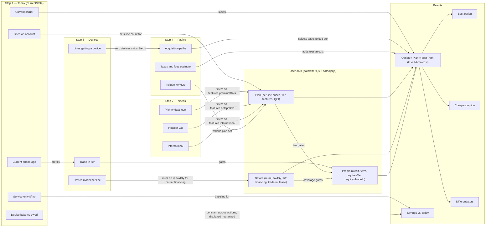

# Domain model — the relationship graph behind the questions

The consultation and the filtering both hang off this graph. Each
question exists because an entity on the left constrains an entity on
the right; when an edge's answer is already known (or moot), the
question is skipped or prefilled. This is what keeps the flow short and
the results filtered with fewer errors.

## The rules the graph encodes

**Question generation / skipping**

| Edge | Behavior |
| --- | --- |
| Current phone age → trade-in | The trade-in answer is prefilled from the phones' age (`suggestTradeIn`); the user can override it. |
| Device count → paying step | Zero new devices makes every acquisition-path question moot, so Step 4 is skipped. |
| Calls & texts | Never asked: every plan in the data includes unlimited calls and texts, so the question carries no information. |

**Filtering (all engine-enforced, BDD-tested)**

| Edge | Rule |
| --- | --- |
| Needs → Plan | `matchesNeeds`: priority data, hotspot GB, international must meet or exceed the stated need; failing plans are excluded and reported. |
| Device.soldBy → carrier financing | A carrier that doesn't sell the device can't finance it; that line falls back to manufacturer financing with a note. |
| Trade-in + Plan.tier + Device → Promo | A promo applies only when its carrier, device list, minimum tier, and trade-in requirement are all satisfied. |
| Device.lease → lease path | No lease offer in the data means no lease option (never estimated). |
| MVNO → paths | MVNO device catalogs aren't in the data, so MVNO options price devices direct from the maker. |

**Classification**

| Output | Definition |
| --- | --- |
| True 24-month cost | Everything paid in months 1–24 plus device balance still owed at month 24. |
| Cheapest option | Lowest true 24-month cost among qualifying options (one option per plan — its best path). |
| Best option | Highest feature score (priority data, hotspot, international), tie broken by lower true cost. |
| Differentiators | A superlative uniquely held (most hotspot, largest credits, best QCI) or a feature most options lack (international, price lock, taxes included). Differentiated options rank above undifferentiated ones. |
| Savings vs. today | `currentMonthly × 24 − option true cost` — labeled as service-only vs. all-in. The current device balance is owed under every option, so it's displayed but never changes the ranking. |

When adding an entity (a carrier, a plan type, a new acquisition path),
add its edges here first — the edges tell you which question, filter, or
differentiator has to exist, and the BDD suite's data-integrity
scenarios enforce the data side.
